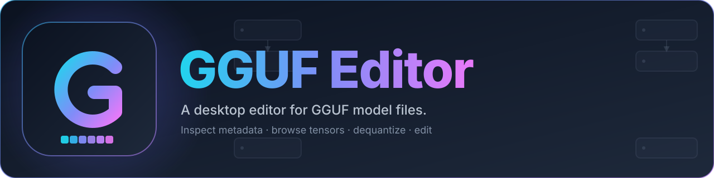

<p align="center">
  
</p>

# GGUF Editor

A desktop editor for [GGUF](https://github.com/ggerganov/ggml/blob/master/docs/gguf.md) model files — inspect metadata, browse tensors, view dequantized values, and make targeted edits.

Built with Electron, React, TypeScript, and Tailwind CSS.

## Features

- Browse and edit GGUF metadata (strings, numbers, arrays)
- Inspect tensor shapes, types, and quantization info
- Dequantize tensor blocks and view numeric values
- Tensor statistics (min/max/mean/std)
- Raw hex editor for direct byte-level edits
- File overview with architecture-aware summaries
- Save edits in place or export a copy

## Installing on macOS

The Mac builds are not notarized with an Apple Developer ID, so on first launch macOS will block the app with *"Apple could not verify 'GGUF Editor' is free of malware…"*. After moving the app to `/Applications`, run:

```bash
xattr -cr "/Applications/GGUF Editor.app"
```

Then open the app normally. This only needs to be done once per install.

## Project structure

```
src/
  main/        Electron main process — GGUF parser/writer, IPC, file I/O
  preload/     Context bridge exposed to the renderer
  renderer/    React UI (components, store, styles)
build/         App icons used by electron-builder
```

## Development

Requirements: Node.js 20+ and npm.

```bash
npm install
npm run dev         # launch the app with hot reload
```

### Scripts

| Script | Purpose |
| --- | --- |
| `npm run dev` | Start electron-vite in watch mode |
| `npm run build` | Type-check and bundle main/preload/renderer |
| `npm run preview` | Run the bundled build locally |
| `npm run package` | Produce a platform distributable via electron-builder |

## Packaging a distribution

`electron-builder` reads the `build` config from `package.json`. To build a local distribution for your current OS:

```bash
npm run build
npm run package
```

Artifacts are written to `dist/`.
